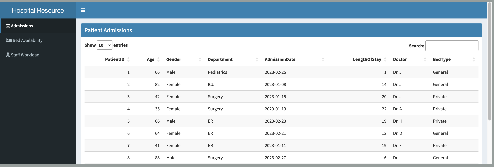
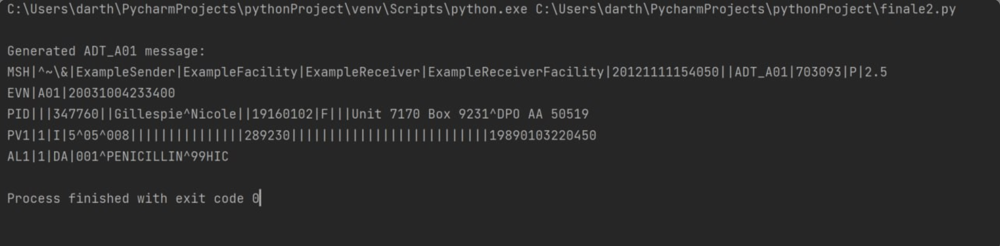
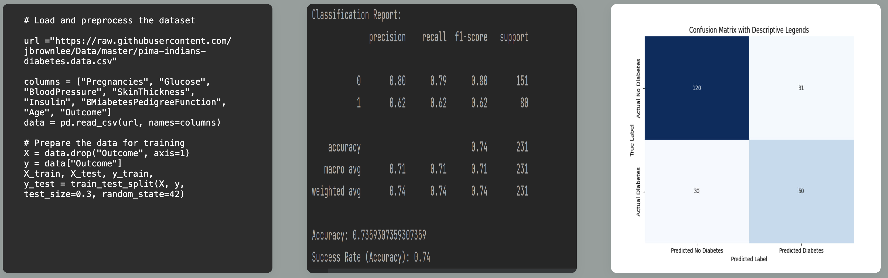
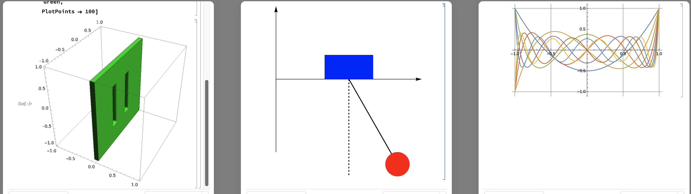

# Portfolio

A professional portfolio to showcase your work, skills, and achievements. This portfolio serves as a way to demonstrate your data in a way that GitHub cannot.

## Table of Contents

- [Clinical Dashboard](#clinical-dashboard)
- [Random ADT Generator](#random-adt-generator)
- [Machine Learning](#machine-learning)
- [Mathematica Visualizations](#mathematica-visualizations)
- [Contributing](#contributing)
- [Contact](#contact)

## Clinical Dashboard

This hospital resource management dashboard features three tabs providing real-time insights into hospital resources. With the capability to process live patient data, our app enables the filtering and sorting of data to optimize resource utilization and improve patient care. An interactive version is avalable on [shinyapp](https://darthnewhopee.shinyapps.io/emergency/?_ga=2.101306498.2059886193.1680392953-163364251.1680392953). 

## Random ADT Generator

In this section, showcase your Random ADT Generator project. Include a brief description of the project, technologies used, and any relevant code snippets or examples.

## Machine Learning

This code uses logistic regression, a statistical model, to predict the presence of diabetes based on a set of features. The features are scaled and the model is trained and evaluated using accuracy, confusion matrix, and classification report. The model has a success rate of 74%.

## Mathematica Visualizations

These visualizations showcase 3-projects . The first is a 3D renderd cube that can be moved in any direction. The second is a Pendulum that predicts movement on a mass frictionless surface. The thid is an equi-potential curve for constant electric current. All models were created with Mathematica and LaTex.  Interactive versions are accessible via Mathematica Online Notebook [here](https://www.wolframcloud.com/obj/tg021/Published/CubeRender.nb), [here](https://www.wolframcloud.com/obj/tg021/Published/Pendulum.nb), and [here](https://www.wolframcloud.com/obj/tg021/Published/EquiCurv.nb). 

## Contributing

Contributions are always welcome! If you have any suggestions, feature requests, or bug reports, please [open an issue](https://github.com/your_username/professional-portfolio/issues) or [submit a pull request](https://github.com/your_username/professional-portfolio/pulls).

## Contact

- Email: your_email@domain.com
- GitHub: [@laplacesol](https://github.com/laplacesol)
- LinkedIn: [linkedin/tgebece](https://www.linkedin.com/in/tgebece/)
- Personal website: [https://laplacesol.github.io/portfolio/](https://laplacesol.github.io/portfolio/)
